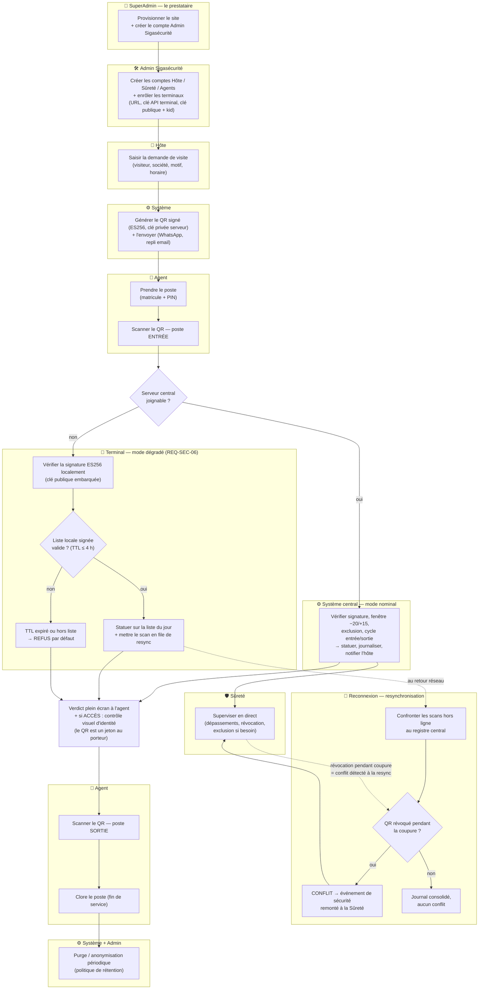

# NOVACCÈS — Cycle de vie d'une visite

Vue de bout en bout : provisionnement, demande de visite, QR signé, contrôle
au poste (nominal **et** mode dégradé), supervision sûreté, sortie, purge.
Complète le schéma simple en y ajoutant la branche coupure réseau et la
détection de conflit à la resynchronisation.

## Points de sécurité portés par le schéma

- **Chaîne de délégation** : chaque niveau ne crée que le niveau du dessous ;
  le prestataire ne gère jamais les comptes du client (moindre privilège
  administratif).
- **Identité de terminal ≠ identité d'agent** : la clé API authentifie
  l'appareil, le matricule + PIN authentifie la personne. Un terminal volé se
  révoque en tuant sa clé API, sans toucher aux comptes agents.
- **`kid` dès l'enrôlement** : les QR portent l'identifiant de la clé qui les
  a signés — la rotation de clé n'invalide pas les QR en circulation.
- **Refus par défaut** : liste locale expirée (TTL ≤ 4 h) ou visiteur hors
  liste → refus, jamais de laisser-passer.
- **La signature prouve le document, pas le porteur** : sur tout accès
  autorisé, l'agent fait un contrôle visuel d'identité (le QR transite par
  WhatsApp/email et reste transférable).
- **Révocation pendant coupure** : non propagée hors ligne (risque accepté et
  borné par le TTL), mais systématiquement détectée à la resynchronisation et
  remontée en événement de sécurité.
